# 🧠 Consultas SQL e análises

### 1. Qual o salário médio entre todas as vagas? 

````sql
SELECT 
    COUNT(*) AS "Total de vagas",
    ROUND(AVG(salario),2) AS "Media dos salários" 
FROM Vaga;
````
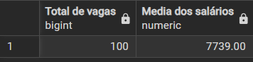

- ***Entre 77 vagas disponíveis, o salário médio é de R$ 7.998,70.***

***

### 2. Qual os 10 maiores salários oferecidos?

````sql
SELECT 
    titulo_vaga AS "Nome vaga",
    salario AS "Salário"
FROM Vaga 
ORDER BY salario DESC
LIMIT 10;
````
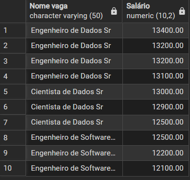

- ***O maior salário oferecido é para a vaga de engenheiro de dados Sênior, com salário de R$ 12.500.***

***

### 3. Qual é a média, o maior e o menor salário por tipo de contrato?

````sql
SELECT 
    tipo_contrato AS "Tipo do contrado", ROUND(AVG(salario),2) AS "Media", 
    MAX(salario) AS "Maior", MIN(salario) AS "Menor"
FROM Vaga GROUP BY tipo_contrato;
````
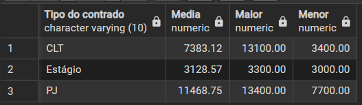

- ***A média salarial para CLT e PJ, é de aproximadamente R$ 8.000, enquanto para estágio, possuem média significativamente menor, com cerca de R$ 3.800. O maior salário identificado pertence a uma vaga CLT, enquanto o menor salário está associado às vagas de estágio e CLT.***

***

### 4. Qual a quantidade de vagas que oferecem salários maiores que R$ 5.000

````sql
SELECT 
    COUNT(salario) AS "Quantidade das vagas com salário maior que 5000"
FROM Vaga 
WHERE salario > 5000
````
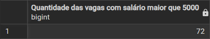

- ***entre 77 vagas, 60 vagas oferecem salários maiores que R$ 5.000, indicando que a maioria das oportunidades apresenta remuneração acima desse valor.***

***

### 5. Quais as quantidades de vagas para CLT e PJ?

````sql
SELECT 
	tipo_contrato AS "Tipo do contrato", 
	COUNT(*) AS "Quantidade" 
FROM Vaga 
WHERE tipo_contrato = 'CLT' OR tipo_contrato = 'PJ'
GROUP BY tipo_contrato;
````
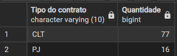

- ***Foram identificadas que para vagas CLT, existem 67 vagas, enquanto para vagas PJ, existem apenas 7, indicando que as empresas apresentam preferências por contratos no regime CLT.***

***

### 6. Qual a quantidade de vagas para cada nível de experiência?

````sql
SELECT 
	nivel_experiencia AS "Nível de experiencia", 
	COUNT(*) AS "Quantidade" 
FROM Vaga 
GROUP BY nivel_experiencia;
````
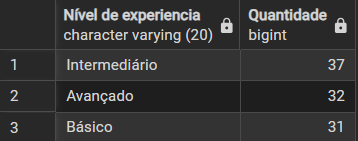

- ***Verifica-se que a maior quantidades de vagas está concentrada em níveis intermediários, enquanto a menor quantidade de vagas está associada a níveis básicos, indicando maior demanda para profissionais com alguma experiência prévia.***

***

### 7. Qual a média salarial para cada nível de experiência?

````sql
SELECT 
	nivel_experiencia AS "Nível de experiencia", 
	ROUND(AVG(salario),2) AS "Média"
FROM Vaga 
GROUP BY nivel_experiencia;
````
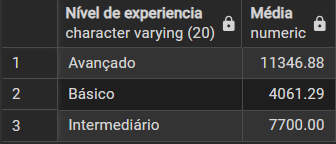

- ***A média salarial cresce de acordo com o nível de experiência, com profissionais com níveis mais avançados apresentando remunerações superiores e uma maior média salarial.***

***

### 8. Qual a quantidade de empresas por porte?

````sql
SELECT 
	porte, 
	COUNT(*) AS "Quantidade" 
FROM Empresa 
GROUP BY porte;
````


- ***Podemos ver que a quantidade de empresas de porte médio e pequeno são iguais, com 17 empresas cada, enquanto as de grande porte, somam 16 registros.***

***

### 9. Quais as quantidades de vagas por tipo de modalidade?

````sql
SELECT CASE
	WHEN id_modalidade = 1 THEN 'Presencial'
	WHEN id_modalidade = 2 THEN 'Remoto'
END AS "Tipo da modalidade", COUNT(*) AS "Quantidade"
FROM Vaga GROUP BY id_modalidade
````
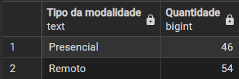

- ***Observa-se que as modalidades presencial e remotas apresentam quase a mesma quantidade de vagas, indicando que as empresas continuam a adotar as duas modalidades de forma equilibrada.***

***

### 10. Quais as habilidades mais requisitadas do mercado?

````sql
SELECT 
	h.nome_habilidade AS "Habilidade", COUNT(*) AS "Quantidade"
FROM Vaga_Habilidade vh 
	JOIN Habilidade h ON vh.id_habilidade = h.id_habilidade
GROUP BY h.id_habilidade 
ORDER BY "Quantidade" DESC 
LIMIT 3;
````
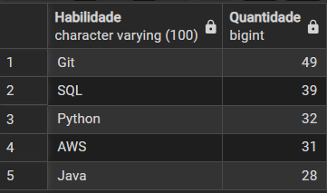

- ***A habilidade mais requisitada no mercado de TI foi a linguagem Python, seguida por SQL e Java, evidenciando uma demanda mais forte para as linguagens mais utilizadas no mercado atual.***

***

### 11. Em que estado cada empresa está localizada?

````sql
SELECT 
	e.nome_empresa AS "Empresa", l.estado 
FROM empresa e 
JOIN vaga v ON e.id_empresa = v.id_empresa
JOIN localizacao l ON l.id_localizacao = v.id_localizacao
````
<table>
	<tr>
		<td>
			
		</td>
		<td>
			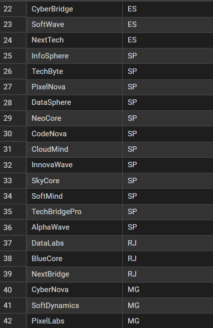
		</td>
		<td>
			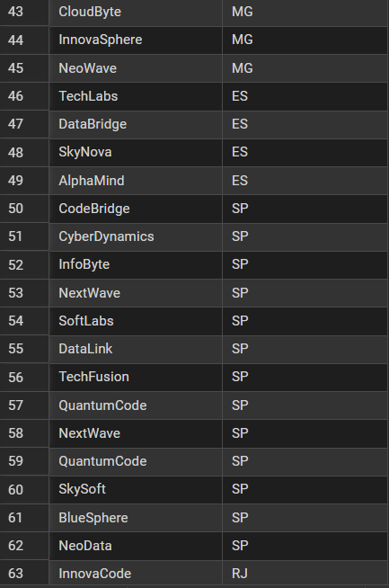
		</td>
	</tr>
</table>

***

### 12. Quais as quantidades de vagas em cada estado brasileiro?

````sql
SELECT 
	l.estado AS "Estado", 
	COUNT(*) AS "Quantidade"
FROM Vaga v 
JOIN Localizacao l ON v.id_localizacao = l.id_localizacao
GROUP BY "Estado" 
ORDER BY "Quantidade" DESC;
````
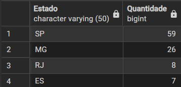

- ***O estado de São Paulo apresentam uma diferença significativa aos demais estados, sendo o estado com a maior quantidade de vagas, o que pode estar relacionado a grande densidade urbana e industrial e forte presença de empresas tecnológicas.***

***

### 13. Quais as médias salariais de cada cargo?

````sql
SELECT 
	f.nome_funcao AS "Função", 
	ROUND(AVG(v.salario),2) AS "Média salarial"
FROM Vaga v 
JOIN Funcao f ON v.id_funcao = f.id_funcao
GROUP BY f.nome_funcao 
ORDER BY "Média salarial" DESC;
````
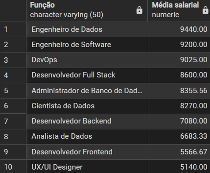

- ***Observamos que as maiores médias salariais são para cargos de engenheiro de software e engenheiro de dados, ultrapassando uma média de R$ 10.000, seguido por Ciêntista de dados, administrador de BD e DevOPS, ultrapassando 
R$ 9.000, indicando que áreas com maior complexidade técnicas apresentam salários mais elevados.***

***

### 14. Quais as médias salariais para cada estado?

````sql
SELECT 
	l.estado AS "Estado", 
	ROUND(AVG(salario),2) AS "Média salarial"
FROM Vaga v 
JOIN Localizacao l ON v.id_localizacao = l.id_localizacao
GROUP BY l.estado 
ORDER BY "Média salarial" DESC;
````
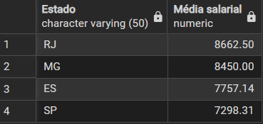

- ***O estado do Espírito Santo apresenta a maior média salarial, com uma média de R$ 8.714. São Paulo, mesmo sendo o estado com a maior quantidade de vagas, também apresentam a menor média salarial entre os estados registrados, com uma média de R$ 7.828***

***

### 15. Qual o maior e menor salário de cada empresa?
#### Para evitar redundância, nesta query, foi utilizado a cláusula HAVING, para apenas filtrar empresas que possuem mais de 1 vaga.

````sql
SELECT 
	e.nome_empresa, 
	MAX(v.salario) AS "Maior salário", 
	MIN(v.salario) AS "Menor salário"
FROM Vaga v 
JOIN Empresa e ON v.id_empresa = e.id_empresa
GROUP BY e.id_empresa 
HAVING COUNT(v.id_vaga) > 1;
````
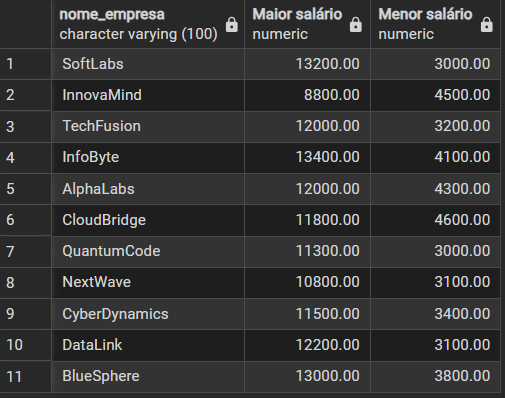

***

### 16. Qual a média de salário por função e modalidade?

````sql
SELECT 
	e.nome_empresa AS "Empresa",
	m.nome_modalidade AS "Modalidade",
	f.nome_funcao AS "Função",
	ROUND(AVG(v.salario),2) AS "Media de salário"
FROM Vaga v 
JOIN Empresa e ON v.id_empresa = e.id_empresa
JOIN Modalidade m ON v.id_modalidade = m.id_modalidade
JOIN Funcao f ON v.id_funcao = f.id_funcao
GROUP BY 1,2,3 
ORDER BY "Empresa", "Modalidade" DESC;
````

<table width = "120">
	<tr>
		<td>
			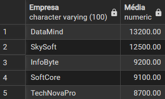
		</td>
	<tr>
		<td>
			
		</td>
	</tr>
	<tr>
		<td>
			
		</td>
	</tr>
</table>

***

### 17. Quais as habilidades mais requisitadas por função?

````sql
SELECT 
	f.nome_funcao AS "Função",
	h.nome_habilidade AS "Habilidade",
	COUNT (h.nome_habilidade) AS "Quantidade de empresas que pedem"
FROM Vaga v 
JOIN Funcao f ON v.id_funcao = f.id_funcao
JOIN Vaga_Habilidade vh ON v.id_vaga = vh.id_vaga
JOIN Habilidade h ON vh.id_habilidade = h.id_habilidade
GROUP BY 1,2 
ORDER BY "Função", COUNT(h.nome_habilidade) DESC;
````
<table>
	<tr>
		<td>
			
		</td>
	<tr>
		<td>
			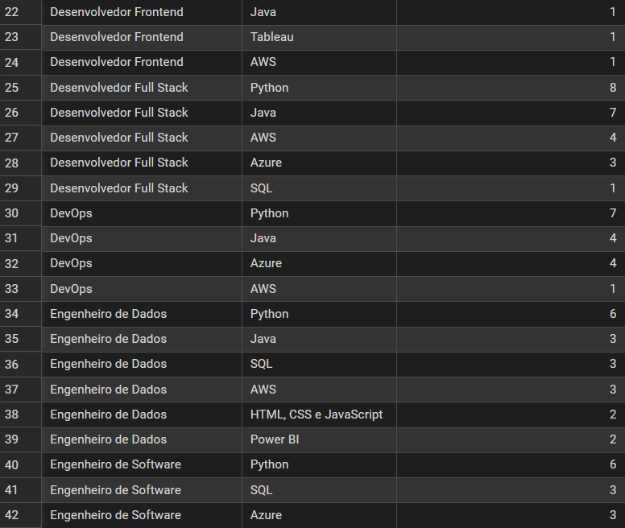
		</td>
	</tr>
	<tr>
		<td>
			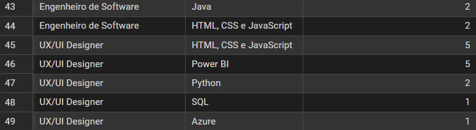
		</td>
	</tr>
</table>


- ***Cargos para engenheiro de dados, engenheiro de software e cientistas de dados exigem uma quantidade maior de habilidades técnicas quando comparadas a outros cargos, que exigem uma menor quantidade de competências.***

***

### 18. Qual o maior salário por função dentro de cada empresa.

````sql
SELECT 
	e.nome_empresa AS "Empresa",
	f.nome_funcao AS "Função",
	MAX(v.salario) AS "Maior"
FROM Vaga v 
JOIN Empresa e ON v.id_empresa = e.id_empresa
JOIN Funcao f ON v.id_funcao = f.id_funcao
GROUP BY 1,2 
ORDER BY "Função", "Maior" DESC;
````
<table>
	<tr>
		<td>
			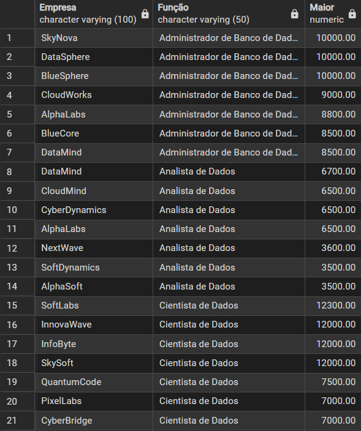
		</td>
	<tr>
		<td>
			
		</td>
	</tr>
	<tr>
		<td>
			
		</td>
	</tr>
</table>

- ***Podemos ver que as empresas que oferecem cargos de engenheiro de dados, engenheiro de software e cientista de dados, apresentam uma remuneração maior. Isso confirma que cargos em que exigem uma quantidade maior de habilidades técnicas, possuem uma média salarial superior.***

*** 

### 19. Quais as empresas que apresentam os maiores salários?

````sql
SELECT 
	e.nome_empresa AS "Empresa",
	ROUND(AVG(v.salario),2) AS "Média"
FROM Vaga v 
JOIN Empresa e ON v.id_empresa = e.id_empresa
GROUP BY 1 
ORDER BY "Média" DESC
LIMIT 5;
````
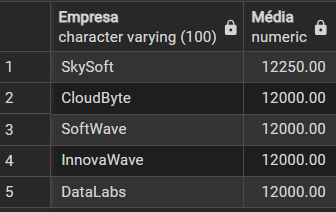
