# Consultas SQL e análises

## Principais consultas SQL desenvolvidas para análise do mercado de trabalho em TI

### 1. Qual o salário médio entre todas as vagas? 

````sql
SELECT 
	COUNT(*) AS "Total de vagas",
	ROUND(AVG(salario),2) AS "Media dos salários" 
FROM Vaga;
````
***Entre as 100 vagas disponíveis, o salário médio é de R$ 7.739.***

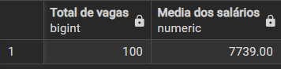

***

### 2. Qual os 10 maiores salários oferecidos?

````sql
SELECT 
    titulo_vaga AS "Nome vaga",
    salario AS "Salário"
FROM Vaga 
ORDER BY salario DESC
LIMIT 10;
````

***O maior salário oferecido é para a vaga de engenheiro de dados Sênior, com salário de R$ 13.400.***

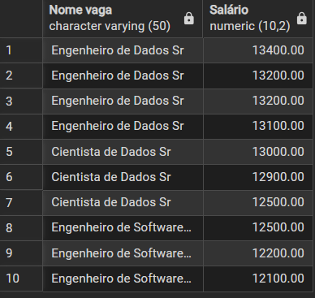

***

### 3. Qual é a média, o maior e o menor salário por tipo de contrato?

````sql
SELECT 
    tipo_contrato AS "Tipo do contrado", ROUND(AVG(salario),2) AS "Media", 
    MAX(salario) AS "Maior", MIN(salario) AS "Menor"
FROM Vaga GROUP BY tipo_contrato;
````
***A média salarial para CLT é de aproximadamente R$ 7.500 e para PJ aproximadamente R$ 11.500, enquanto para estágio possuem média significativamente menor, com cerca de R$ 3.000. O maior salário identificado pertence a uma vaga PJ, enquanto o menor salário está associado a vagas de estágio e CLT.***

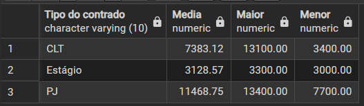

***

### 4. Qual a quantidade de vagas que oferecem salários maiores que R$ 5.000

````sql
SELECT 
    COUNT(salario) AS "Quantidade das vagas com salário maior que 5000"
FROM Vaga 
WHERE salario > 5000
````

***entre 100 vagas, 72 vagas oferecem salários maiores que R$ 5.000, indicando que a maioria das oportunidades apresenta remuneração acima desse valor.***


***

### 5. Quais as quantidades de vagas para CLT e PJ?

````sql
SELECT 
	tipo_contrato AS "Tipo do contrato", 
	COUNT(*) AS "Quantidade" 
FROM Vaga 
WHERE tipo_contrato = 'CLT' OR tipo_contrato = 'PJ'
GROUP BY tipo_contrato;
````

***Foram identificadas que para vagas CLT, possuem 77, enquanto para vagas PJ, existem apenas 16, indicando que as empresas apresentam preferências por contratos no regime CLT.***

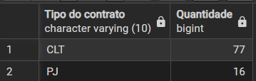

***

### 6. Qual a quantidade de vagas para cada nível de experiência?

````sql
SELECT 
	nivel_experiencia AS "Nível de experiencia", 
	COUNT(*) AS "Quantidade" 
FROM Vaga 
GROUP BY nivel_experiencia;
````

***Verifica-se que a maior quantidades de vagas está concentrada em níveis intermediários, enquanto a menor quantidade de vagas está associada a níveis básicos, indicando maior demanda para profissionais com alguma experiência prévia.***


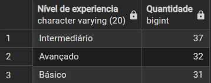

***

### 7. Qual a média salarial para cada nível de experiência?

````sql
SELECT 
	nivel_experiencia AS "Nível de experiencia", 
	ROUND(AVG(salario),2) AS "Média"
FROM Vaga 
GROUP BY nivel_experiencia;
````

***A média salarial cresce de acordo com o nível de experiência, com profissionais com níveis mais avançados apresentando remunerações superiores e uma maior média salarial.***


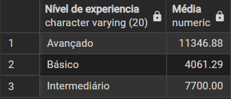

***

### 8. Qual a quantidade de empresas por porte?

````sql
SELECT 
	porte, 
	COUNT(*) AS "Quantidade" 
FROM Empresa 
GROUP BY porte;
````

***Podemos ver que a quantidade de empresas de porte médio e pequeno são iguais, com 17 empresas cada, enquanto as de grande porte, somam 16 registros.***


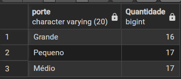

***

### 9. Quais as quantidades de vagas por tipo de modalidade?

````sql
SELECT CASE
	WHEN id_modalidade = 1 THEN 'Presencial'
	WHEN id_modalidade = 2 THEN 'Remoto'
END AS "Tipo da modalidade", COUNT(*) AS "Quantidade"
FROM Vaga GROUP BY id_modalidade
````
***Observa-se que as modalidades remoto possui uma quantidade maior do que a presencial, indicando que as empresas estão adotando o trabalho remoto como estratégia de maior flexibilidade e eficiência.***


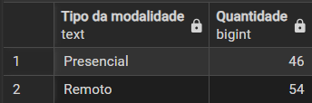

***

### 10. Quais as habilidades mais requisitadas do mercado?

````sql
SELECT 
	h.nome_habilidade AS "Habilidade", COUNT(*) AS "Quantidade"
FROM Vaga_Habilidade vh 
	JOIN Habilidade h ON vh.id_habilidade = h.id_habilidade
GROUP BY h.id_habilidade 
ORDER BY "Quantidade" DESC 
LIMIT 5;
````

***A habilidade mais requisitada no mercado de TI foi a linguagem SQL (desconsiderando Git), seguida por Python, AWS e Java, evidenciando uma demanda maior pelas tecnologias mais utilizadas atualmente.***

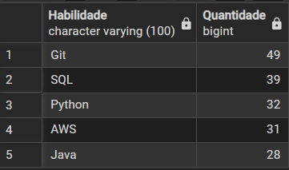

***

### 11. Quais as quantidades de vagas em cada estado brasileiro?

````sql
SELECT 
	l.estado AS "Estado", 
	COUNT(*) AS "Quantidade"
FROM Vaga v 
JOIN Localizacao l ON v.id_localizacao = l.id_localizacao
GROUP BY "Estado" 
ORDER BY "Quantidade" DESC;
````

***Podemos observar que a maioria das empresas está localizada no estado de São Paulo, indicando uma concentração em regiões mais desenvolvidas e com maior potencial econômico.***

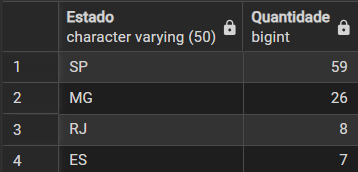

***

### 12. Quais as médias salariais de cada cargo?

````sql
SELECT 
	f.nome_funcao AS "Função", 
	ROUND(AVG(v.salario),2) AS "Média salarial"
FROM Vaga v 
JOIN Funcao f ON v.id_funcao = f.id_funcao
GROUP BY f.nome_funcao 
ORDER BY "Média salarial" DESC;
````

***Observamos que as maiores médias salariais são para cargos de engenheiro de software e engenheiro de dados, ultrapassando uma média de R$ 9100, seguido por administrador de BD e DevOPS, ultrapassando R$ 8.500, indicando que áreas com maior complexidade técnicas apresentam salários mais elevados.***

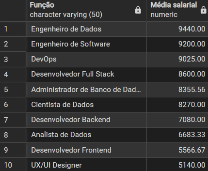

***

### 13. Quais as médias salariais para cada estado?

````sql
SELECT 
	l.estado AS "Estado", 
	ROUND(AVG(salario),2) AS "Média salarial"
FROM Vaga v 
JOIN Localizacao l ON v.id_localizacao = l.id_localizacao
GROUP BY l.estado 
ORDER BY "Média salarial" DESC;
````

***O estado do Rio de Janeiro apresenta a maior média salarial, com uma média de R$ 8.662,50. São Paulo, mesmo sendo o estado com a maior quantidade de vagas, também apresentam a menor média salarial entre os estados registrados, com uma média de R$ 7.298,31***

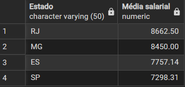

***

### 14. Qual o maior e menor salário de cada empresa?
#### Para evitar redundância, nesta query, foi utilizado a cláusula HAVING, para apenas filtrar empresas que possuem mais de 1 vaga.

````sql
SELECT 
	e.nome_empresa, 
	MAX(v.salario) AS "Maior salário", 
	MIN(v.salario) AS "Menor salário"
FROM Vaga v 
JOIN Empresa e ON v.id_empresa = e.id_empresa
GROUP BY e.id_empresa 
HAVING COUNT(v.id_vaga) > 1;
````

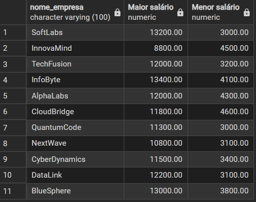

***

### 15. Quais as empresas que apresentam os maiores salários?

````sql
SELECT 
	e.nome_empresa AS "Empresa",
	ROUND(AVG(v.salario),2) AS "Média"
FROM Vaga v 
JOIN Empresa e ON v.id_empresa = e.id_empresa
GROUP BY 1 
ORDER BY "Média" DESC
LIMIT 5;
````

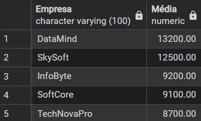
